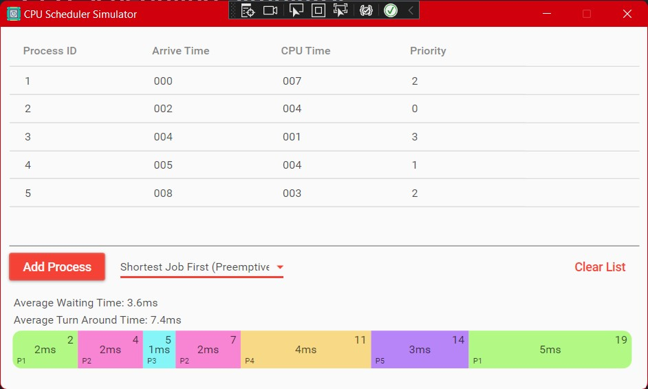

# CPU Scheduling Simulator

Simple schedule simulator with a graphical interface made for SE (Operating Systems) by Mohamed Amin Ben Chrifa and Eskander Badboud.

 * [Download]() executable
 * [See](https://github.com/ookii-tsuki/cpu-scheduling-sim/tree/master/CPUScheduling%20Sim/Source) source code

## Preview

